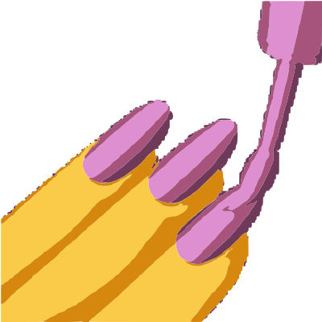
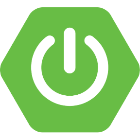
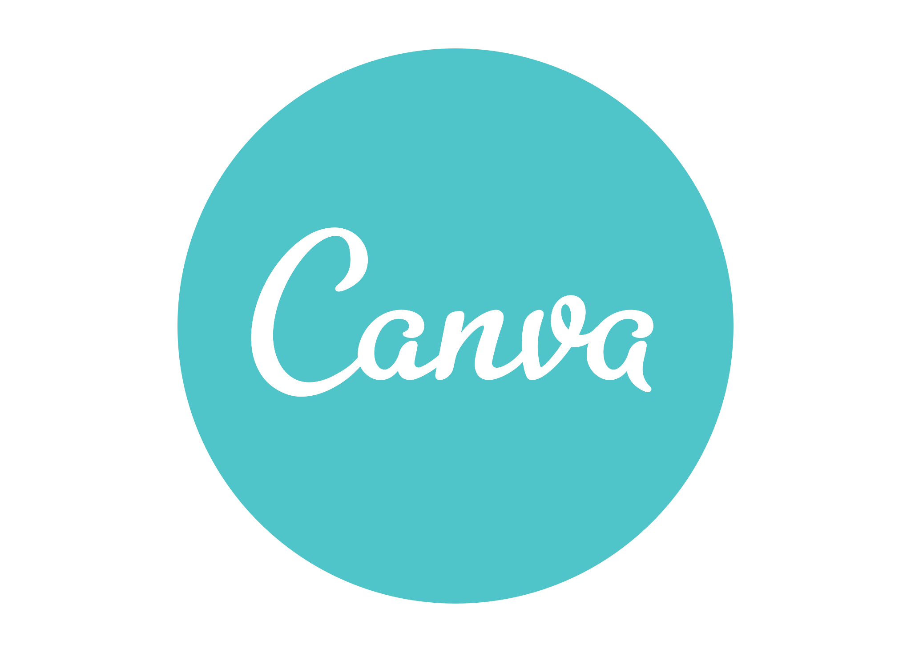

  

## 💫 About Me

### Hi there 👋

- 🔭 I’m working at [F-Code](https://www.facebook.com/fcodefpt) as **Front-end Vice Leader**, who teaches ReactJS at the club.
- 🌱 I’m currently learning **Java**.
- 👯 I’m focusing **Front-end Development** and practicing **Back-end Web Development**
- 🤔 I’m a student of [FPT University HCMC](https://hcmuni.fpt.edu.vn/)
<!-- - 💬 Ask me about ...
- 📫 How to reach me: ...
- 😄 Pronouns: ...
- ⚡ Fun fact: ... -->

## 🔭 Favorite Tech

> Tools, languages, and other things that I like to work with.

<h3 align="center">Programming Language</h3>
<table align="center">
  <tr>
    <td align="center" width="96">
      
       C
    </td>
    <td align="center" width="96">
      
       C#
    </td>
    <td align="center" width="96">
      
       Java
    </td>
    <td align="center" width="96">
      
       JavaScript
    </td>
    <td align="center" width="96">
      
       TypeScript
    </td>
  </tr>
</table>

<h3 align="center">Front-end</h3>
<table style="margin: auto" align="center">
  <tr>
    <td align="center" width="96">
      
       HTML
    </td>
    <td align="center" width="96">
      
       CSS
    </td>
    <td align="center" width="96">
      
       JavaScript
    </td>
    <td align="center" width="96">
      
       ReactJS
    </td>
  </tr>

  <tr>
    <td align="center" width="96">
      
       ViteJS
    </td>
    <td align="center" width="96">
      
       NextJS
    </td>
    <td align="center" width="96">
      
       Sass
    </td>
    <td align="center" width="96">
      
       Tailwind
    </td>
  </tr>

  <tr align="center">
    <td align="center" width="96">
      
       Styled Components
    </td>
    <td align="center" width="96">
      
       Bootstrap
    </td>
    <td align="center" width="96">
      
       Redux
    </td>
    <td align="center" width="96">
      
       ANT Design
    </td>
  </tr>
</table>

<h3 align="center">Back-end</h3>
<table align="center">
  <tr>
    <td align="center" width="96">
      
       NodeJS
    </td>
    <td align="center" width="96">
      
       ExpressJS
    </td>
    <!-- <td align="center" width="96">
      
       Spring
    </td> -->
    <td align="center" width="96">
      
       Spring Boot
    </td>
    <td align="center" width="96">
      
       .NET
    </td>
  </tr>
</table>

<h3 align="center">Database</h3>
<table align="center">
  <tr>
    <td align="center" width="96">
      
       SQL Server
    </td>
    <td align="center" width="96">
      
       MongoDB
    </td>
    <td align="center" width="96">
      
       Firebase
    </td>
    <td align="center" width="96">
      
       MySQL
    </td>
  </tr>
</table>

<h3 align="center">System & DevOps</h3>
<table align="center">
  <tr>
    <td align="center" width="96">
      
       Linux
    </td>
    <td align="center" width="96">
      
       Lightsail
    </td>
    <td align="center" width="96">
      
       Docker
    </td>
    <td align="center" width="96">
      
       GitHub Actions
    </td>
  </tr>
</table>

## 🎨 Designation

> Tools that I like to design with.

<table align="center">
  <tr>
    <td align="center" width="96">
      
       Photoshop
    </td>
    <td align="center" width="96">
      
       Illustrator
    </td>
    <td align="center" width="96">
      
       Figma
    </td>
    <td align="center" width="96">
      
       Canva
    </td>
  </tr>
</table>

## 📊 GitHub Stats

   
   
   

## 🏆 GitHub Trophies

  

<!-- ### ✍️ Random Dev Quote

  

### 🔝 Top Contributed Repo

  

 -->

## 👀 Profile Views

  

## 🌐 Socials

  
  
  

